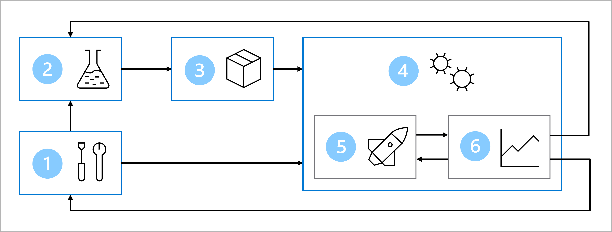

# MLOps-Azure, creando una canalización de un modelo a producción con Azure Machine Learning y GitHub Actions

# Intro

[Machine Learning Operations (MLOps)](https://learn.microsoft.com/en-us/azure/machine-learning/concept-model-management-and-deployment?view=azureml-api-2) se basa en los principios y prácticas de DevOps que aumentan la eficiencia en el despliegue y el flujo de trabajo en modelos de Machine Learning en producción.

Este repositorio contiene el código y las pautas para configurar el flujo de trabajo de MLOps con Azure:
Se trata de un modelo de clasificación que ayuda a los profesionales a detectar posibles casos de diabetes teniendo en cuenta ciertos datos tomados del paciente.

## Arquitectura

1. Configuración: creación de todos los recursos de Azure necesarios para la solución.

2. Desarrollo de modelos (bucle interno): análisis y procesamiento de los datos para entrenar y evaluar el modelo.

3. Integración continua: empaquetado y registro del modelo.

4. Implementación de modelos (bucle externo): implementación del modelo.

5. Implementación continua: prueba del modelo y promoción al entorno de producción.

6. Supervisión: supervisión del rendimiento del modelo y del punto de conexión.

## Descripcion del proyecto

El objetivo es crear una canalizacion end-to-end para hacer predicciones en tiempo real cuando se introduzcan los datos del paciente y poder re-entrenar el modelo utilizando scripts cuando se presenten una cantidad considerable de nuevos datos o cuando el modelo empiece a degradarse.

Si bien los Jupyter notebooks son excelentes para explorar y compartir datos, generalmente se consideran que **"No son para produccion"** debido a que su naturaleza es enfocada en investigacion y ejecución por celdas; los notebooks las dificultades de integración con una arquitectura de software sólida , además que, no son la mejor opción para ser implementados en un endpoint, (como una API) y que sea facil y automatizable su mantenimiento con las mejores prácticas de DevOps. 

Para solucionar estas complicaciones debemos convertir estos cuadernos en scripts, hacer el codigo modular para que sea facilmente automatizable, utilizando herramientas MlOps, este proyecto es un ejemplo sencillo de cómo podría ser la ejecución de un modelo 'en producción' utilizando servicios cloud de Azure. 

Mediante la incorporación de cuatro pilares de proyectos de Software Sólidos:

- Control de versiones
- Código modular
- Pruebas unitarias y de integración
- CI/CD

## To Do

- [x] Crear un modelo de Machine Learning
- [x] Crear un repositorio en GitHub
- [x] Crear un entorno de desarrollo local
- [x] Crear un entorno de desarrollo en Azure
- [x] Crear un entorno de producción en Azure
- [x] Crear un pipeline de CI/CD con GitHub Actions
- [x] Crear un pipeline de CI/CD con Azure Machine Learning y GitHub Actions

